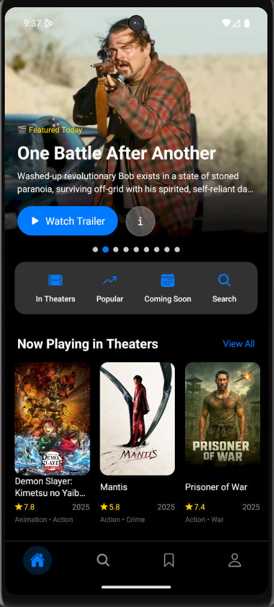
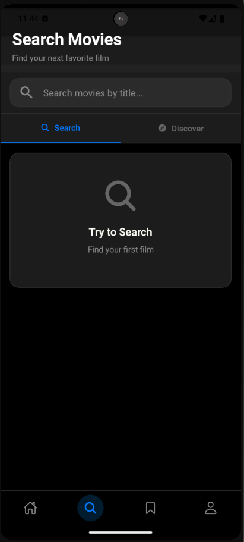
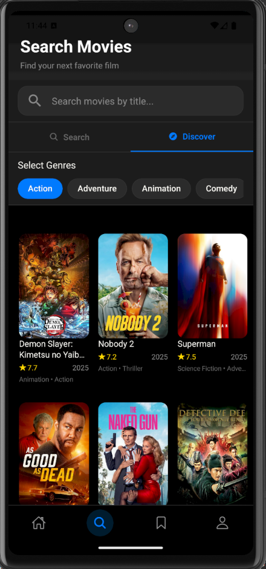
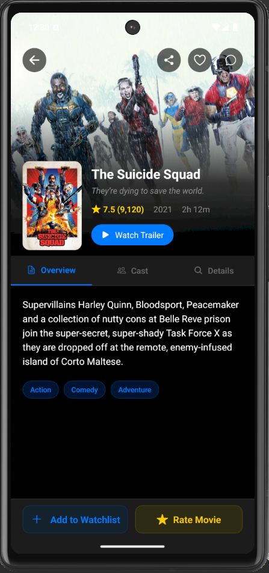

# Welcome to Watcher 👋

## Project Description

**Watcher** is a cross-platform mobile app for movie lovers, developed in _React Native (Expo)_. Users can browse new releases, watch trailers, read descriptions, rate movies, share their opinions in the comments, and save their favorites to a personal collection. The app provides a full user experience, from authorization and content personalization to profile management.

This is an [Expo](https://expo.dev) project created with [`create-expo-app`](https://www.npmjs.com/package/create-expo-app).

---

## Key features and implemented technology stack

This project showcases my skills in creating full-fledged React Native apps for iOS and Android:

### 📱 Frontend & Navigation

- [React Native](https://reactnative.dev/docs) (Expo): Develop a cross-platform app using a modern functional approach.
- Expo Router: Implementation of navigation between screens (navigation stack) via the file system.
- Responsive UI: The interface displays correctly on devices with different screen sizes.

### 🎨 User Interface (UI/UX)

- Dynamic theming: Implemented support for light and dark themes with the ability to switch on the fly. Using context (React Context) to distribute the theme throughout the application.
- Custom Components: Building an interface with reusable and styled components. Using: [React Native Paper](https://callstack.github.io/react-native-paper/)

### 🔐 Authentication and Backend-as-a-Service (BaaS)

- **[Supabase](https://supabase.com/)**: A complete implementation of a user data authentication and storage system. -**[OAuth 2.0](https://oauth.net/2/)**: Integrate authorization through third-party providers (Google, GitHub, Facebook), providing users with fast and secure login.
- Profile Management: Functionality for changing profile data, as well as deleting it completely (including associated data in the database), demonstrating an understanding of the user lifecycle.

### 📡 Working with external APIs

- **[The Movie Database (TMDB) API](https://www.themoviedb.org/)**: Integration with a major external API for up-to-date information on movies, cast, trailers (via YouTube), and images.
- Query Optimization: Using caching, loading state handling, and error handling to ensure a smooth user experience with - **[Tanstack React Query](https://tanstack.com/query/latest)**
- Search by Title: Implementation of full-text search across the movie database via the integrated TMDB API. Search operates in real time with query debouncing to reduce API load and improve interface responsiveness.
- Advanced Genre Filtering: Users can filter and discover new movies by selecting the genres they're interested in. Integration with TMDB provides an up-to-date list of genres.
- Search State Management: Efficient state management for managing search queries, results, and selected filters to ensure application predictability and performance.

### 💾 Client-server interaction logic

- CRUD operations: The application fully works with data:
- Create: Add comments to movies, add movies to Favorites.
- Read: Gets and displays movie lists, comments, ratings, user profile.
- Update: Edit your profile, update your movie rating, and comment on it.
- Delete: Delete comments, delete movies from Favorites, delete account.
- Supabase Database: Designing and working with a relational database (PostgreSQL) for storing user profiles, favorites, comments, and ratings.

### 🔔 Notification and communication system

- [Push Notifications (Expo Notifications)](https://docs.expo.dev/push-notifications/push-notifications-setup/): Implementing a push notification subscription system for new movie releases using the Expo Push Notifications service and (FCM).

- Email Newsletters with [Resend](https://resend.com/docs/send-with-nextjs): Integrating a subscription system for email updates about new movie releases.

- [Supabase Edge Functions](https://supabase.com/docs/guides/functions): Critical business logic (event handling, working with external APIs for sending emails and push notifications) is moved to the server using Supabase Edge Functions written in JavaScript/TypeScript. This demonstrates an understanding of serverless architecture and secure handling of secrets (API keys).

- [RPC (Remote Procedure Calls)](https://supabase.com/docs/reference/javascript/rpc): Using Supabase's RPC mechanism to call custom functions on the database side. This demonstrates the ability to work not only with direct table queries but also with complex server-side logic encapsulated in the database.

---

## What does this project demonstrate?

- This application is not just a tutorial, but a comprehensive project that demonstrates my ability to:

- Integrate various services and APIs into a single ecosystem (TMDB, Supabase, OAuth providers, Expo Notifications, Email services).

- Develop an architecture for data and application state, including separating client and server logic.

- Create an intuitive and responsive UI based on best practices.

- Implement a full authorization cycle and work with user data.

- Work with server logic without a dedicated backend: Using Supabase Edge Functions and RPC to create a fully functional backend, a modern and in-demand approach.

- Implement complex user interaction features, such as a subscription and notification system (push/email).

- Optimize API interactions: Use techniques to reduce the number of requests (e.g. debouncing for searches) and efficient data caching.

- Write clean, maintainable, and structured code across the entire project stack.
<!-- markdownlint-disable MD033 -->

### Home screen

### Search screen

  
  

### Movie Details Screen

